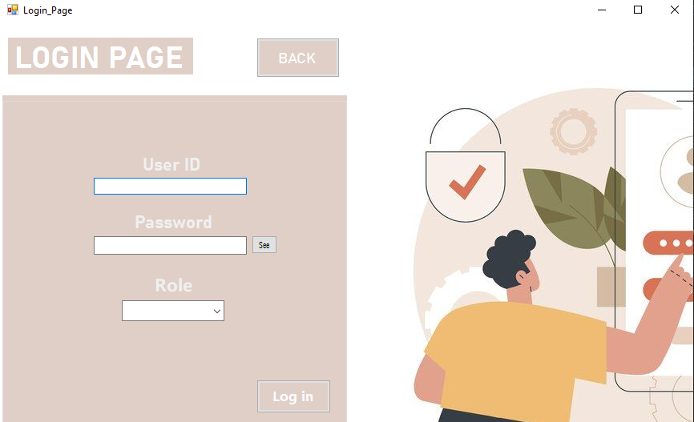
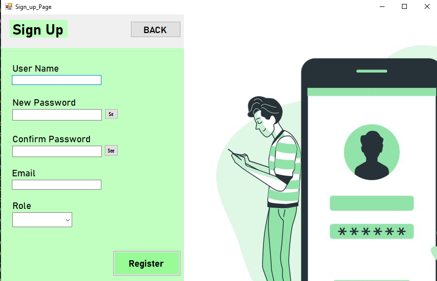

# E-Commerce Application - Database Project


## 📋 Project Overview

A comprehensive e-commerce store application built with **C# Windows Forms** and **Oracle Database**, implementing a complete **3-tier architecture**. The system supports role-based access control for six different user types with full CRUD operations, stored procedures, and transaction management.

**Developed by:** Muneeb Arif  
**Email:** muneebarif226@gmail.com  

---

## 🏗️ Architecture

### **3-Tier Architecture Implementation**

```
┌─────────────────────────────────────────┐
│   Presentation Layer (Tier 1)           │
│   - Windows Forms UI                    │
│   - Role-specific dashboards            │
│   - Input validation                    │
└─────────────────────────────────────────┘
              ↓
┌─────────────────────────────────────────┐
│   Business Logic Layer (Tier 2)         │
│   - ProductService                      │
│   - OrderService                        │
│   - UserService                         │
│   - CartService                         │
└─────────────────────────────────────────┘
              ↓
┌─────────────────────────────────────────┐
│   Data Access Layer (Tier 3)            │
│   - ProductDAL                          │
│   - OrderDAL                            │
│   - UserDAL                             │
│   - CartDAL                             │
│   - Oracle Database with Stored Procs   │
└─────────────────────────────────────────┘
```

---

## 🎯 Key Features

### ✅ **Role-Based Access Control**
- **Customer** - Browse, purchase, and review products
- **Manager/Admin** - Product and category management
- **Cashier** - Order processing and delivery assignment
- **Inventory Staff** - Stock management and alerts
- **Delivery Personnel** - Order delivery tracking
- **Admin** - Full system access

### ✅ **Core Functionalities**
- User authentication and registration
- Product search with category filtering
- Shopping cart management
- Secure checkout with multiple payment methods
- Order history tracking
- Product review system
- Inventory management with low-stock alerts
- Delivery tracking and status updates

### ✅ **Database Features**
- 10 normalized tables
- 8 stored procedures
- Transaction management
- Referential integrity constraints
- Proper indexing for performance

---

## 📸 Application Screenshots

### 1. Login Page

*User authentication with role selection*

### 2. Sign Up Page

*New user registration with role assignment*

### 3. Customer Dashboard

*Product browsing and search functionality*

### 4. Shopping Cart

*Cart management with quantity updates*

### 5. Manager Dashboard

*Product and inventory management*

### 6. Delivery Dashboard

*Order delivery tracking and status updates*

### 7. Review System

*Customer product reviews and ratings*

---

## 🗄️ Database Schema

### **Tables:**
- `USERS` - User accounts and authentication
- `CATEGORIES` - Product categories
- `PRODUCTS` - Product information
- `CART` - User shopping carts
- `CART_ITEMS` - Cart item details
- `ORDERS` - Customer orders
- `ORDER_ITEMS` - Order line items
- `PAYMENTS` - Payment transactions
- `DELIVERY` - Delivery assignments
- `REVIEWS` - Product reviews and ratings

### **Stored Procedures:**
- `sp_AddProduct` - Add new products with category management
- `sp_UpdateInventory` - Update product stock quantities
- `sp_ProcessCheckout` - Complete order processing with transactions
- `sp_AssignDelivery` - Assign orders to delivery personnel
- `sp_MarkOrderDelivered` - Update delivery status
- `sp_AddReview` - Add product reviews
- `sp_GetLowStockProducts` - Retrieve low stock alerts
- `calculate_order_total` - Calculate order totals (function)

---

## 🛠️ Technology Stack

### **Frontend:**
- C# .NET Framework
- Windows Forms
- Custom UI controls and styling

### **Backend:**
- Business Logic Layer (BLL)
- Data Access Layer (DAL)
- Oracle.ManagedDataAccess.Client

### **Database:**
- Oracle Database 11g/12c/19c
- PL/SQL Stored Procedures
- Sequences for auto-increment

---

## 📁 Project Structure

```
E-commerce/
├── WindowsFormsApp1/
│   ├── BusinessLogic/          # Business Logic Layer
│   │   ├── ProductService.cs
│   │   ├── OrderService.cs
│   │   ├── UserService.cs
│   │   └── CartService.cs
│   │
│   ├── DataAccess/             # Data Access Layer
│   │   ├── ProductDAL.cs
│   │   ├── OrderDAL.cs
│   │   ├── UserDAL.cs
│   │   └── CartDAL.cs
│   │
│   └── Forms/                  # Presentation Layer
│       ├── Login Page.cs
│       ├── Sign_up Page.cs
│       ├── Customer Dashboard.cs
│       ├── Cart_Page.cs
│       ├── Check_out.cs
│       ├── Order_history.cs
│       ├── Review Page.cs
│       ├── Manager.cs
│       ├── Inventory.cs
│       ├── Cashier.cs
│       └── Delievery.cs
│
└── Database/
    ├── DatabaseSchema.sql      # Complete DB schema
    └── StoredProcedures.sql    # All stored procedures
```

---

## 🚀 Setup Instructions

### **Prerequisites:**
- Visual Studio 2019 or later
- Oracle Database 11g/12c/19c
- .NET Framework 4.7.2 or later

### **Database Setup:**

1. **Create Database User:**
   ```sql
   -- Run as SYSTEM/SYS
   CREATE USER DB_PROJECT IDENTIFIED BY 1234;
   GRANT CONNECT, RESOURCE, DBA TO DB_PROJECT;
   ```

2. **Create Schema:**
   ```bash
   # Connect as DB_PROJECT
   @Database/DatabaseSchema.sql
   ```

3. **Create Stored Procedures:**
   ```bash
   @Database/StoredProcedures.sql
   ```

### **Application Setup:**

1. Clone the repository
2. Open `WindowsFormsApp1.sln` in Visual Studio
3. Add new files to project:
   - All files in `BusinessLogic/` folder
   - All files in `DataAccess/` folder
   - `Inventory.cs`, `Inventory.Designer.cs`, `Inventory.resx`
4. Add reference to `Microsoft.VisualBasic`
5. Build and run (F5)

---

## 👤 Default User Credentials

| Role | Username | Password |
|------|----------|----------|
| Admin | admin | admin123 |
| Manager | manager1 | manager123 |
| Cashier | cashier1 | cashier123 |
| Inventory | inventory1 | inventory123 |
| Delivery | delivery1 | delivery123 |
| Customer | customer1 | customer123 |

---

## 🔍 Expected Outputs

### **Customer Workflow:**
1. ✅ Login with customer credentials
2. ✅ Search products by category (Electronics, Clothing, Books, etc.)
3. ✅ Add products to cart with quantity selection
4. ✅ View cart with calculated totals
5. ✅ Checkout with payment method selection (Cash, Card, PayPal)
6. ✅ View order history with status tracking
7. ✅ Write product reviews with ratings (1-5 stars)

### **Manager Workflow:**
1. ✅ Login as manager
2. ✅ View all products in inventory
3. ✅ Add new products with auto-category creation
4. ✅ Delete existing products
5. ✅ Update product information

### **Inventory Staff Workflow:**
1. ✅ Login as inventory staff
2. ✅ View all products with stock levels
3. ✅ Check low stock alerts (< 20 units)
4. ✅ Update stock quantities via inline editing
5. ✅ Refresh inventory view

### **Cashier Workflow:**
1. ✅ Login as cashier
2. ✅ View pending orders
3. ✅ Select delivery personnel from dropdown
4. ✅ Assign orders to delivery staff
5. ✅ Update order status to "Assigned to Delivery"

### **Delivery Workflow:**
1. ✅ Login as delivery personnel
2. ✅ View assigned orders with product details
3. ✅ Mark orders as "Delivered"
4. ✅ Update delivery status in real-time

---

## 🎓 Learning Outcomes

This project demonstrates proficiency in:
- ✅ **3-Tier Architecture** design and implementation
- ✅ **Database Design** with normalization and relationships
- ✅ **Stored Procedures** for business logic encapsulation
- ✅ **Transaction Management** for data integrity
- ✅ **Role-Based Access Control** (RBAC)
- ✅ **Object-Oriented Programming** with C#
- ✅ **UI/UX Design** with Windows Forms
- ✅ **CRUD Operations** with parameterized queries
- ✅ **Error Handling** and validation
- ✅ **Session Management** for user state

---

## 📝 Requirements Fulfilled

✅ Full-scale GUI development for all user roles  
✅ Role-specific forms with consistent UI design  
✅ Responsive layout with modern styling  
✅ Business Logic Layer with separate service classes  
✅ Data Access Layer with CRUD operations  
✅ Oracle Database with stored procedures  
✅ Complete database schema with constraints  
✅ Transaction management with rollback support  
✅ Role-based access control implementation  
✅ Comprehensive documentation and testing  

---

## 📧 Contact

**Developer:** Muneeb Arif  
**Email:** muneebarif226@gmail.com  
**GitHub:** [@muneeb-codehub](https://github.com/muneeb-codehub)  
**Institution:** FAST National University

---

## 📄 License

This project is developed for educational purposes as part of the Database Systems course at Aligarh Muslim University.

---

**⭐ If you found this project helpful, please consider giving it a star!**
